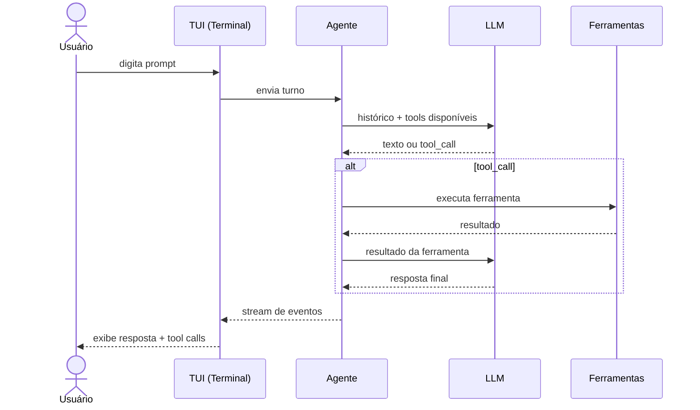
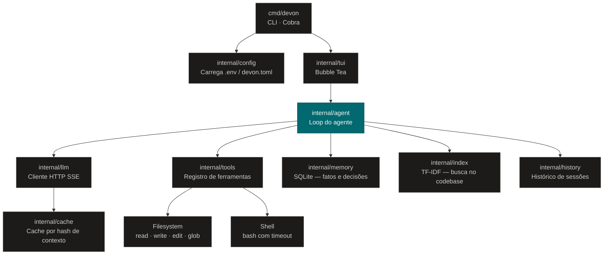
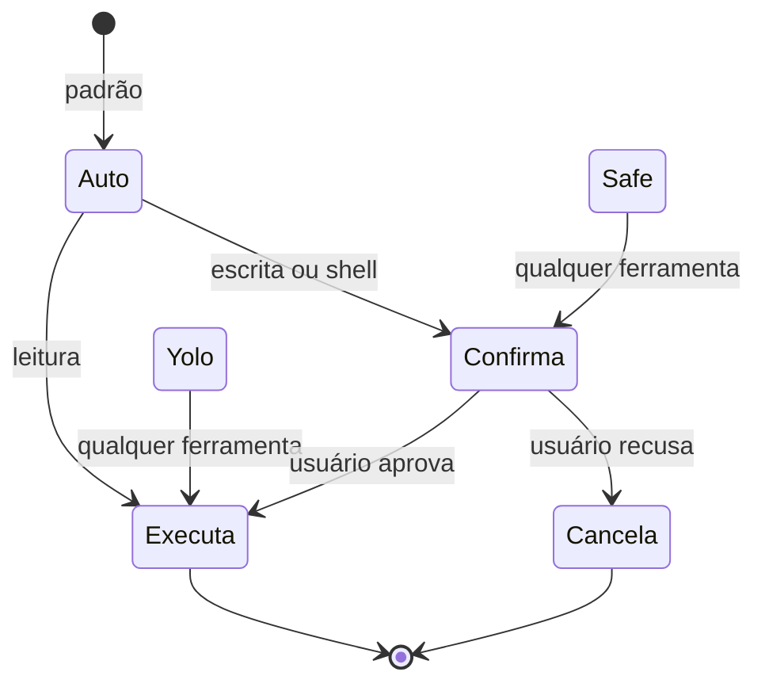
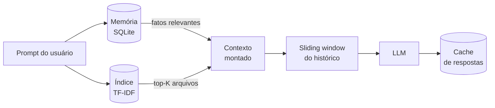
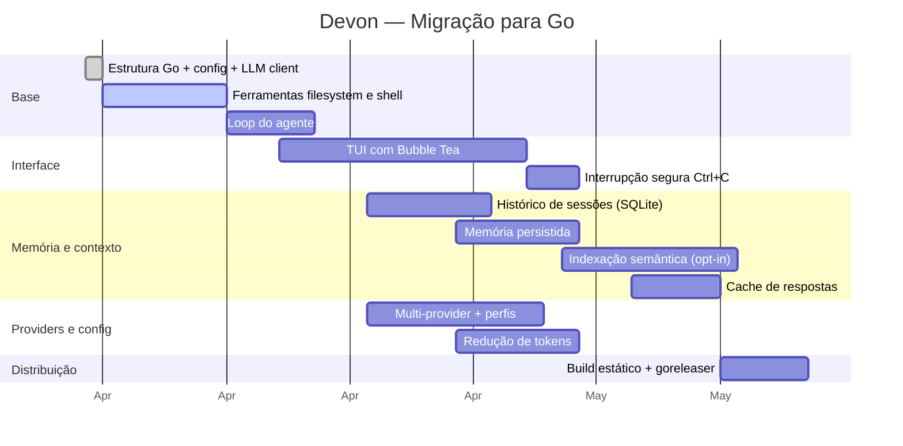

# Devon

[](https://github.com/ElioNeto/devon/actions/workflows/ci.yml)

Agente de código com TUI, escrito em Go. Use qualquer LLM com API compatível com OpenAI — OpenRouter, Gemini, Groq, Ollama ou qualquer provider local.

---

## Como funciona



---

## Arquitetura (versão Go)



---

## Funcionalidades

### Controle de permissões



| Modo | Comportamento |
|---|---|
| `auto` (padrão) | Leitura livre · escrita e shell pedem confirmação |
| `safe` | Toda ferramenta pede confirmação |
| `yolo` | Executa tudo sem perguntar |

### Otimização de tokens



- **Memória persistida** — fatos e decisões do projeto entre sessões
- **Indexação semântica** — injeta só os arquivos relevantes *(opt-in)*
- **Compressão de histórico** — sliding window de N mensagens
- **Cache de respostas** — zero tokens para prompts repetidos *(modo one-shot)*

---

## Instalação

```bash
curl -fsSL https://raw.githubusercontent.com/ElioNeto/devon/main/install.sh | bash
```

Ou compile do fonte:

```bash
git clone https://github.com/ElioNeto/devon.git
cd devon
make build
```

---

## Início Rápido

### 1. Configure o provider

Crie um `.env` na raiz do projeto que quiser usar:

```bash
DEVON_API_KEY=sk-or-sua-chave-aqui
DEVON_BASE_URL=https://openrouter.ai/api/v1
DEVON_MODEL=mistralai/devstral-2512:free
```

### 2. Inicie

```bash
devon
```

Veja o [Playbook](docs/PLAYBOOK.md) e o [Guia de Configuração](docs/advanced-setup.md) para mais detalhes.

---

## Providers suportados

| Provider | Base URL | Modelos recomendados |
|---|---|---|
| [OpenRouter](https://openrouter.ai) | `https://openrouter.ai/api/v1` | `mistralai/devstral-2512:free`, `qwen/qwen3-coder:free` |
| Google Gemini | `https://generativelanguage.googleapis.com/v1beta/openai` | `gemini-2.5-flash` |
| Groq | `https://api.groq.com/openai/v1` | `llama-3.3-70b-versatile` |
| Ollama (local) | `http://localhost:11434/v1` | `qwen2.5-coder:32b` |
| OpenAI | `https://api.openai.com/v1` | `gpt-4o` |
| DeepSeek | `https://api.deepseek.com/v1` | `deepseek-chat` |

---

## Ferramentas do Agente

O Devon executa um loop `prompt → LLM → tool call → resultado → LLM` com as seguintes ferramentas:

- **Filesystem:** `read_file`, `write_file`, `edit_file`, `list_dir`, `glob`, `grep`
- **Shell:** `bash` com timeout, captura de stdout/stderr e controle de permissão
- **Contexto:** leitura de `DEVON.md` na raiz do projeto como system prompt adicional

---

## Roadmap



---

## Roadmap

Veja as [issues abertas](https://github.com/ElioNeto/devon/issues) para o roadmap completo de funcionalidades planejadas.

---

## Licença

MIT.
